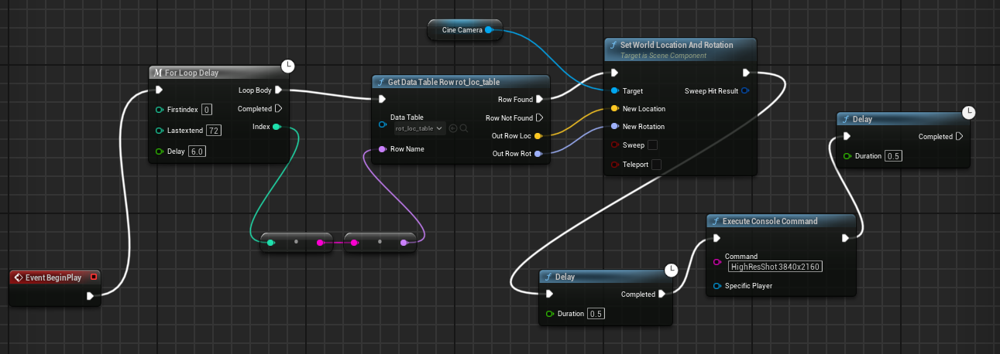

# -Estimation-of-Human-Hip-Size-Using-ArUco-Marker-and-Computer-Vision
 The goal of this project is to create a synthetic dataset which will be used to estimate the hip size of a human  using a 3D mesh, an ArUco marker with known dimensions, and  an AI-driven approach.

# Estimation of Human Hip Size Using ArUco Marker and Computer Vision
- The goal of this project is to estimate the hip size of a human using a 3D mesh, an ArUco marker with known dimensions, and an AI-driven approach.

- note: The "main" folder is the project folder, the "everything_zipped" just has a copy of the dataset used and a copy of this README file  

## Step 1: DATASET GENERATION 

### - To automate the dataset collection using unreal engine, I worked with the unreal engine Blueprints  

## Step 2: requirements.txt

### Install the required dependencies using requirements.txt

## Step 3: TRAINING MODEL

### - To train go to the train.ipynb file inside the main folder. Using the train, test, valid and the data.yaml file inside Human_parts_final-1 folder, I trained a yolov8m model. The best model is saved as best.pt inside the runs/detect/train/weights. I have copied this directly under the main folder for easy access.

## Step 4: ESTIMATE THE WAIST

### - Inside the estimating_waist folder, there is a main.ipynb. Run this file to get the estimates on the test set. 

## Step 5: ACCESSING THE TRAIN, VAL AND TEST SET

### - This is available inside the Human_parts_final-1 folder as test, train and valid folders. Inside each folder you will find the images and the respective labels for each image.